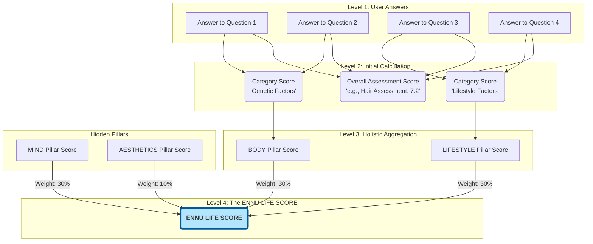

# ENNU Life: Scoring Architecture & Strategy

**Document Version:** 1.0
**Date:** 2025-07-18
**Author:** Luis Escobar
**Status:** OFFICIAL

---

## 1.0 Executive Summary: The Four Tiers of Health Intelligence

This document provides the official architectural and strategic overview of the ENNU Life scoring system. It is the definitive source of truth for understanding how user data is transformed into meaningful, actionable health intelligence.

The system is architected as a four-tier hierarchy, moving from the granular to the holistic. Each tier serves a unique purpose, creating a comprehensive and powerful user journey.

*   **Tier 1: Category Scores (The "Why")** - Granular feedback within a single assessment.
*   **Tier 2: Overall Assessment Score (The "What")** - A simple, top-line score for a specific health vertical.
*   **Tier 3: Pillar Scores (The "Holistic How")** - An aggregated view of a user's health across the four core pillars: Mind, Body, Lifestyle, and Aesthetics.
*   **Tier 4: The ENNU LIFE SCORE (The "Who")** - The ultimate, proprietary metric representing a user's total health equity on the platform.

This architecture is designed to be **stable, scalable, and strategically valuable**, providing rich insights for the user and creating a powerful, proprietary data asset for the business.

---

## 2.0 The Four Tiers: A Detailed Breakdown

### Tier 1: Category Scores (The "Score Breakdown")

*   **Purpose:** To provide specific, actionable feedback within the context of a single assessment. It answers the user's question, "My overall score is a 7.2, but *why*?".
*   **Example:** For the Hair Assessment, the categories include "Genetic Factors," "Progression Rate," "Lifestyle Factors," etc. A user can see their exact score for each, identifying their specific strengths and weaknesses.
*   **Implementation:** Calculated directly from the point values and weights of the questions within that category, as defined in `includes/config/assessment-scoring.php`. This is the foundational layer of raw data.

### Tier 2: Overall Assessment Score

*   **Purpose:** To serve as the simple, primary metric for a single health vertical. It is the main number a user will track to see their progress in one specific area (e.g., Hair, Skin). It answers, "What is my hair health score today?".
*   **Example:** "Your Hair Assessment Score is 7.2/10".
*   **Implementation:** Calculated as the weighted average of all scorable answers within a single assessment. It is displayed prominently on the immediate results page.

### Tier 3: The Health Quad-Pillars

*   **Purpose:** To provide a holistic, at-a-glance view of a user's health by aggregating detailed categories into four core dimensions. This is the primary data model for the Health Dossier and all advanced visualizations. It answers, "How are my lifestyle choices impacting my physical health?".
*   **The Four Pillars:**
    1.  **Mind:** Encompasses psychological factors, stress levels, and treatment motivation.
    2.  **Body:** Encompasses physiological factors, medical history, and genetic predispositions.
    3.  **Lifestyle:** Encompasses daily habits, diet, exercise, and sleep.
    4.  **Aesthetics:** Encompasses the user's primary outward-facing concerns (e.g., hair loss severity, skin condition).
*   **Implementation:** Calculated by grouping the **Tier 1 Category Scores** according to the map defined in `get_health_pillar_map()` and finding the average for each pillar. This score is saved permanently with each assessment result.

### Tier 4: The ENNU LIFE SCORE

*   **Purpose:** This is the ultimate "north star" metric. It is a single, proprietary score that represents the user's total health equity and their identity on the platform. It is the definitive answer to the question, "Who am I, on my health journey?".
*   **Example:** "Your ENNU LIFE SCORE is 8.1".
*   **Implementation:** This is a weighted average of the user's **Tier 3 Pillar Scores**. It is calculated by taking the user's most recent Pillar Scores from *every assessment they have completed*, finding the average for each of the four pillars, and then applying a final set of strategic weights:
    *   **Mind:** 30%
    *   **Body:** 30%
    *   **Lifestyle:** 30%
    *   **Aesthetics:** 10%
*   **Strategic Importance:** Using the Pillar Scores as the foundation for this master metric is a critical architectural decision. It normalizes the data, ensuring that each core dimension of health is weighted appropriately, creating a far more accurate and meaningful score than a simple average of the individual assessment scores would provide.

---

## 3.0 The Strategic Data Flow

This diagram illustrates the complete, end-to-end data flow, from a user's raw answers to the final ENNU LIFE SCORE.

---

## 4.0 The Implementation Plan

The full implementation of this architecture will proceed in three phases:

1.  **Phase 1: Perfect the Foundational Scoring:** A meticulous audit and refinement of all Tier 1 and Tier 2 calculations to ensure absolute accuracy.
2.  **Phase 2: Architect Pillar Scores as a Permanent Data Point:** Upgrade the scoring engine to calculate and save Tier 3 Pillar Scores with every assessment submission.
3.  **Phase 3: Implement the ENNU LIFE SCORE:** Build the master algorithm to calculate the Tier 4 score and display it on the User Dashboard.

This strategic plan ensures that each layer of the Health Intelligence system is built upon a solid, reliable foundation, culminating in a powerful and proprietary data platform. 