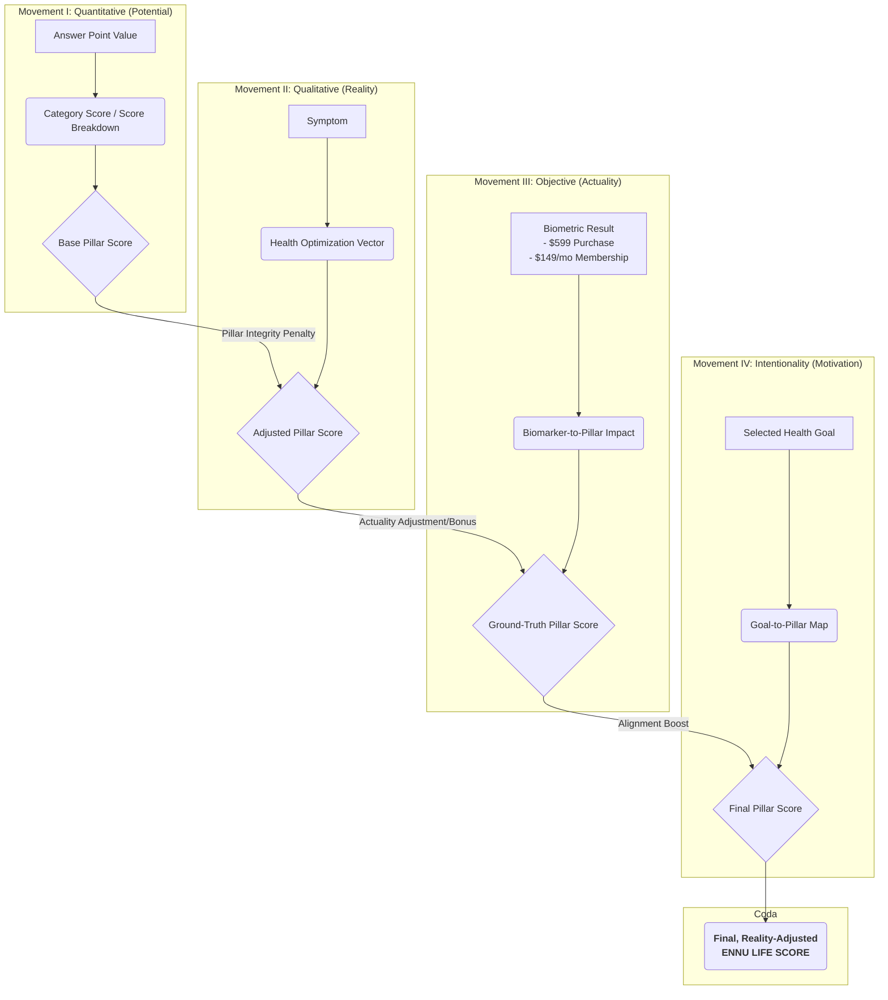

# ENNU Life: The Scoring Symphony - An Architectural Blueprint

**Document Version:** 4.0
**Date:** 2024-07-31
**Author:** Luis Escobar
**Status:** FINALIZED

---

## 1.0 Introduction: The Four Movements of Holistic Health Scoring

This document outlines the architecture for the ENNU Life scoring system. The core principle is the **"Scoring Symphony,"** a perfect synthesis of four distinct data engines to produce a single, truly holistic health score. It is not a chaotic system where everything affects everything else; it is a precise, hierarchical composition.

1.  **The Quantitative Engine (Potential):** Measures a user's health *potential* based on validated, questionnaire-style assessments.
2.  **The Qualitative Engine (Reality):** Assesses a user's current health *reality* by applying penalties based on self-reported symptoms.
3.  **The Objective Engine (Actuality):** Measures a user's health *actuality* using hard data from biomarker lab tests, providing the ultimate ground truth.
4.  **The Intentionality Engine (Alignment):** Measures the user's *alignment* with their stated health goals, providing a boost for focused effort.

The final, evolved ENNU LIFE SCORE is the sound of this entire orchestra playing in harmony.

---

## 2.0 The Grand Unified Theory: A Hierarchical Data Flow

The system is built upon a strict, unchangeable flow of data. Each "movement" of the symphony builds upon the last, creating a score of increasing accuracy and relevance. The four **Health Pillars (Mind, Body, Lifestyle, Aesthetics)** act as the central conductors for this flow.

---

## 3.0 Detailed Mechanics & Implementation

The specific, granular details of every assessment, question, answer, point value, and the complete logic for the new Qualitative Engine are now maintained in the canonical **`MASTER_ASSESSMENT_AND_SCORING_GUIDE.md`**. This brainstorming document shall serve as the high-level conceptual overview, while the Master Guide serves as the definitive implementation blueprint. 