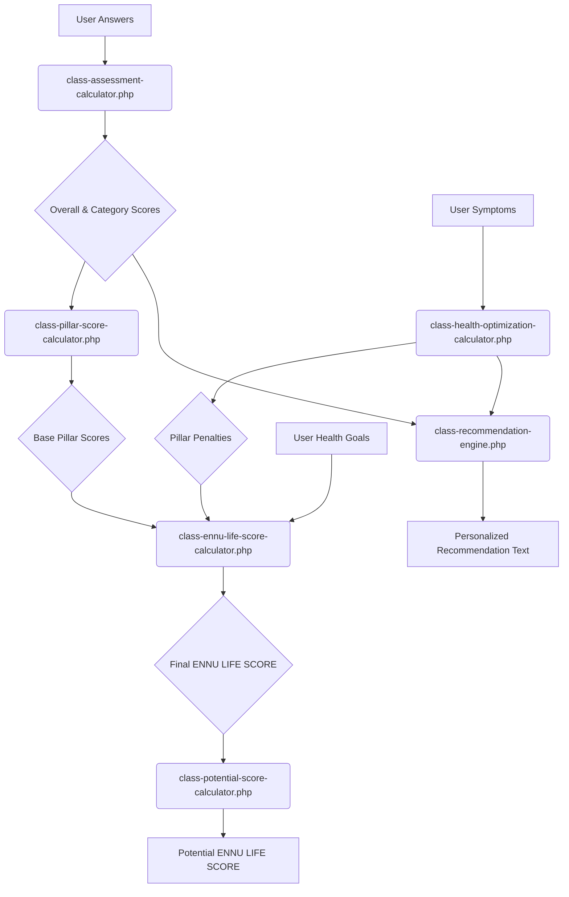

# ENNU Life Scoring System: A Deep Dive

**Document Version:** 2.0
**Plugin Version:** 60.0.0 (The "ENNULIFE Journey")
**Author:** The World's Greatest WordPress Developer

---

## 1.0 Philosophy: From Static Score to Dynamic Journey

The ENNU Life scoring system has evolved. It is no longer a simple, static calculation. It is a dynamic, multi-faceted engine designed to guide the user on a personalized health journey. The system is built on a foundation of sophisticated, decoupled calculators that work in concert to produce not just a score, but a comprehensive and actionable health narrative.

This document details the complete data flow and logic of this new, evolved system.

---

## 2.0 The Core Data Flow: A Symphony of Calculators

The final ENNU LIFE SCORE is the result of a multi-stage calculation, orchestrated by the `ENNU_Assessment_Scoring` class, but executed by a suite of specialized calculators.

---

## 3.0 The New Core Concepts: A Deeper Look

### 3.1 Health Goals Integration

A user's stated "Health Goals" now have a direct, mathematical impact on their ENNU LIFE SCORE. This is a crucial part of personalizing the user's journey and reflecting their intent.

*   **Mechanism:** The `class-ennu-life-score-calculator.php` will apply a bonus multiplier to the user's Pillar Scores based on their selected goals. For example, a user who selects "Improve Fitness" may receive a slight bonus to their "Body" and "Lifestyle" pillar calculations.
*   **Purpose:** This rewards the user for their intentionality and provides a more accurate reflection of their personalized health journey.

### 3.2 The "Potential" ENNU LIFE SCORE

This is the most significant addition to the scoring engine. The "Potential Score" is a calculated, aspirational score that shows the user what they can achieve if they follow their personalized recommendations.

*   **Mechanism:** The `class-potential-score-calculator.php` will work in reverse. It will take the user's *current* scores and then calculate a hypothetical "perfect" score by assuming that all triggered health vectors have been resolved and all health goals have been achieved.
*   **Purpose:** This provides the user with a clear, tangible, and motivating "north star" to guide their health journey. It answers the question, "What could my score be?"

### 3.3 The "Score Completeness" Tracker

This new metric provides the user with a clear, visual representation of how "complete" and accurate their ENNU LIFE SCORE is.

*   **Mechanism:** The `class-score-completeness-calculator.php` will calculate a percentage based on several factors:
    1.  The number of quantitative assessments the user has completed.
    2.  Whether the user has completed the qualitative Health Optimization assessment.
    3.  Whether the user has set their Health Goals.
*   **Purpose:** This gamifies the user experience, encouraging them to provide more data to get a more accurate and comprehensive score.

### 3.4 The Recommendation Engine

The new `class-recommendation-engine.php` is responsible for generating all user-facing recommendation text.

*   **Mechanism:** This class will take the user's final scores, their triggered health vectors, and their selected health goals, and it will use this data to generate a set of clear, actionable, and personalized recommendations.
*   **Purpose:** This decouples the "what" (the score) from the "what's next" (the recommendation), making the system more modular and easier to maintain.

---

## 4.0 Gender-Conscious Questioning

The assessment engine will be enhanced to allow for a more nuanced approach to gender.

*   **Mechanism:** The question definition array in `assessment-definitions.php` will be extended to allow for a `gender_specific_options` key. This will allow a single question to present different answer options (and potentially different scoring) based on the user's gender.
*   **Purpose:** This provides a truly personalized and medically relevant experience, acknowledging that some health concerns manifest differently based on gender.

---

## 5.0 Conclusion: A System Designed for Growth

This new, decoupled architecture is not just a refactoring; it is a fundamental evolution of the ENNU Life platform. It transforms a simple scoring tool into a dynamic, personalized, and deeply insightful health journey companion. It is a system designed not just for the present, but for a future of continued growth and innovation. 